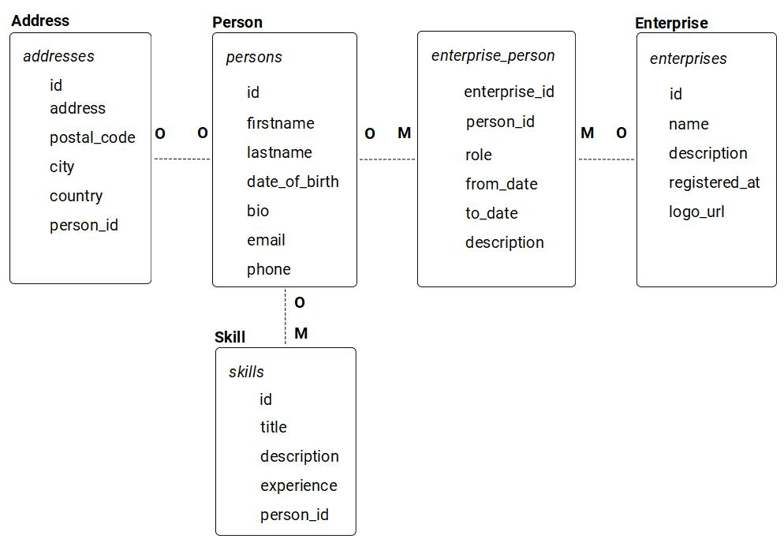

## NanoCRM

Le but est de créer un petit backend qui permet de servir les entités suivantes via GraphQL.
- Les models et leurs relations sont en gras
- Les tables correspondantes en italique

### Installation

- Cloner le repo
- `composer install`
- git checkout de la branche souhaitée
- Copier .env.example sur .env et ajouter la base de données et de ses identifiants dans .env
- `php artisan migrate`
- `php artisan serve` pour le serveur de dev si besoin

### Les branches

- La branche **debug** propose un petit exercice pour suivre une requête "/person/1" tout au long de son cycle de vie.
- La branche **from-scratch** contient uniquement l'installation de Laravel et propose de coder toutes les migrations et les models pour arriver aux entités du schéma.
- La branche **todo-person** contient les models Address, Enterprise, Skills et les migrations correspondantes. Il reste à coder :
  * la migration qui ajoutera la table addresses
  * la migration qui ajoutera les clés étrangères correspondant aux relations
  * le model Person
- La branche **complete** contient toutes les migrations et les models du schéma. Les factories et un seeder sont également présent pour pouvoir générer des données de travail. Pour seeder la base `php artisan db:seed`

### GraphQL

Peu importe la branche de départ, LightHouse est seulement installé, il faut ensuite définir les schémas GraphQL pour pouvoir traiter les requêtes.
